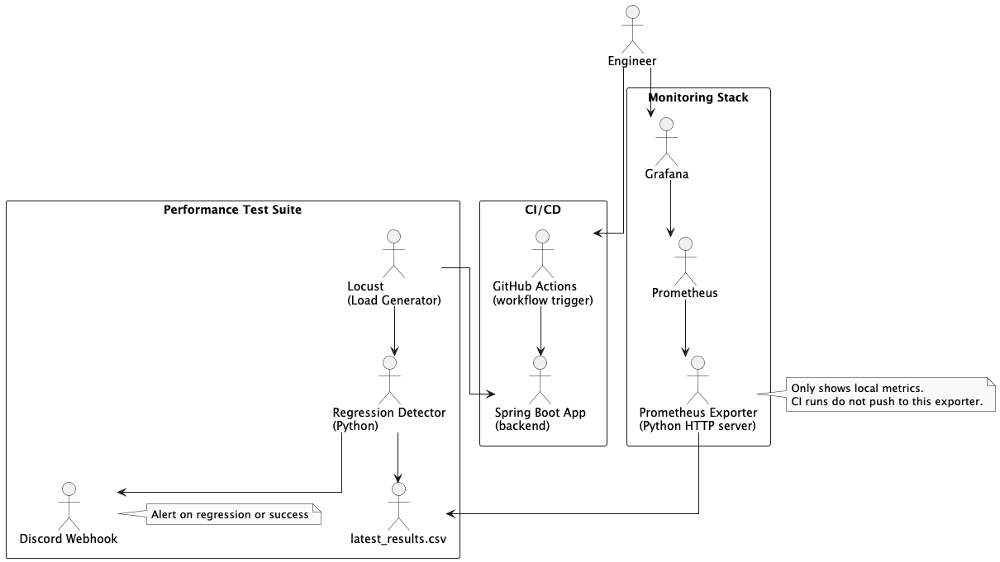
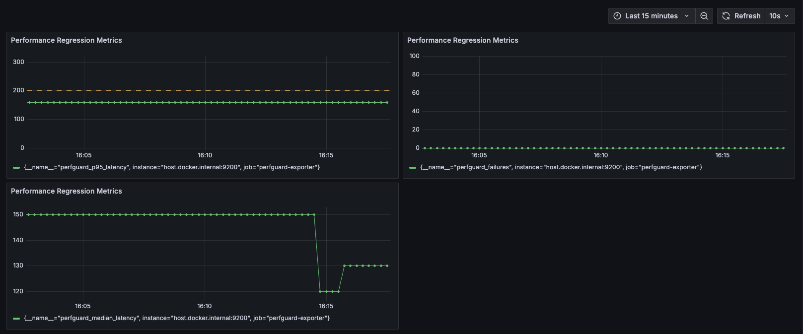
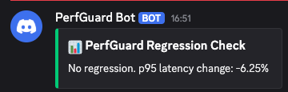

# perfguard

**PerfGuard** is a tool that helps developers automatically catch performance slowdowns in backend applications before 
they reach end users. It simulates real user behavior under load, tracks important performance metrics like latency and 
error rate and alerts developers when performance drops. It contains CI, Grafana dashboards and Discord alerts.

Note: The Prometheus + Grafana stack is designed for local visual monitoring. CI runs trigger regression detection and 
alerts, but they don’t update the local dashboard unless run on the same machine.

---

## Architecture



---

## Why PerfGuard?

In large codebases and fast-moving teams, performance regressions can sneak into production and hurt the user experience. PerfGuard helps catch those regressions early, by:

- Continuously testing user flows under load
- Comparing results to a performance baseline
- Alerting developers if metrics like p95 latency get worse
- Providing real-time dashboards through Prometheus and Grafana

---

## Features

- Load testing with [Locust](https://locust.io/)
- Automatic performance regression detection
- CI integration with GitHub Actions
- Discord alerts on detected regressions
- Real-time Prometheus metrics export
- Grafana dashboard for p95/median latency and error tracking
- Makefile for easy commands

---

## Quick Start

1. Start the backend:
   ```shell
   make run
   ```
   Once the Spring Boot backend is running you can manually test the mock endpoints:
   ```shell
   curl -X POST http://localhost:8080/login \
     -H "Content-Type: application/json" \
     -d '{"user":"alice"}'

   curl "http://localhost:8080/search?query=test"
   ```
2. Run a performance test:
    ```shell
    make test
    ```
3. Save the results as baseline (for future comparisons):
    ```shell
    make baseline
    ```
4. Run another test and detect regressions:
    ```shell
    make alert    
    ```
5. Export metrics:
    ```shell
    make export
    ```
6. Start Prometheus + Grafana:
    ```shell
    make up    
    ```
7. View dashboard:
    ```shell
    make dashboard
    ```
    

Real-time monitoring of:
* 95th percentile latency
* Median response time
* Error/failure count

---

## Notification

After each performance test run (triggered manually or via GitHub Actions), PerfGuard evaluates whether a regression 
occurred based on changes in 95th percentile latency. Regardless of the result, it sends a notification to a configured
Discord channel to keep the team informed.

Example message:



---

## Future Improvements

* Helm chart for Kubernetes deployment
* Markdown/HTML regression reports
* Support for more user flows and load profiles
* Error rate thresholds in addition to latency
* Accessibility metrics (a11y)

---

## Project Structure

```
.
├── locustfile.py             # Load test scenario
├── regression_detector.py    # Baseline comparison logic
├── perfguard_exporter.py     # Prometheus metrics exporter
├── docker-compose.yml        # Prometheus + Grafana
├── prometheus.yml            # Prometheus scrape config
├── Makefile                  # Unified commands
└── src/                      # Spring Boot backend
```

---

## Feedback

This project is personal, but contributions, suggestions and feedback are welcome!